# 🧠 SerenitySaathi Application Workflow

A comprehensive guide to the complete user journey and system interactions in SerenitySaathi - Your Secure Mental Health Companion.

## 📋 Table of Contents

1. [Application Overview](#application-overview)
2. [User Journey Flow](#user-journey-flow)
3. [Authentication Workflow](#authentication-workflow)
4. [Chat Interface Workflow](#chat-interface-workflow)
5. [User Profile Workflow](#user-profile-workflow)
6. [Data Persistence Workflow](#data-persistence-workflow)
7. [Crisis Support Workflow](#crisis-support-workflow)
8. [Technical Architecture](#technical-architecture)
9. [Error Handling](#error-handling)
10. [Security Measures](#security-measures)

## 🎯 Application Overview

SerenitySaathi is a comprehensive mental health application that provides:
- **Secure Authentication** with email/password and password reset
- **AI-Powered Chat Interface** for supportive conversations
- **User Profile Management** with preferences and settings
- **Data Persistence** for chat history and user preferences
- **Crisis Support** with emergency contacts and resources
- **Multi-language Support** (English and Hindi)
- **Dark/Light Mode** with automatic preference saving

## 🔄 User Journey Flow

### 1. Initial Access
```
User visits app → Welcome Page → "Get Started" → Login/Signup Modal
```

### 2. Authentication Flow
```
Login/Signup → Email Verification → Dashboard Access
```

### 3. Main Application Flow
```
Dashboard → Chat Interface → User Profile → Crisis Support → Resources
```

## 🔐 Authentication Workflow

### User Registration
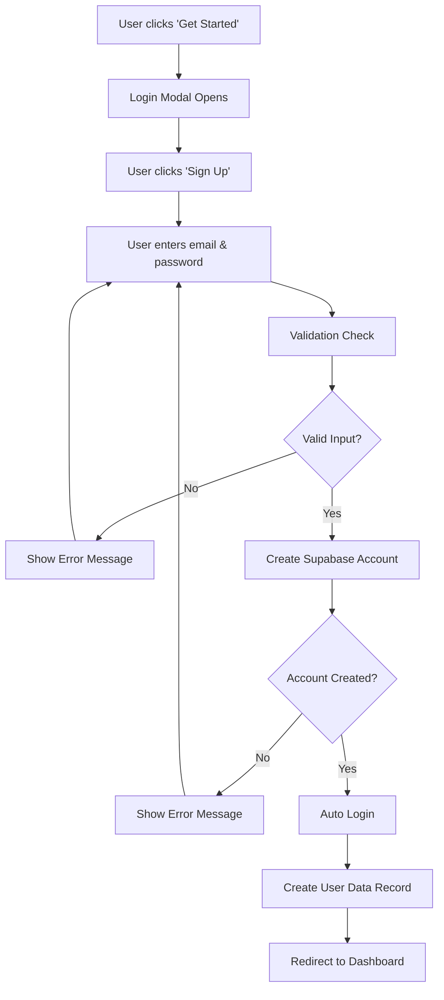

### User Login
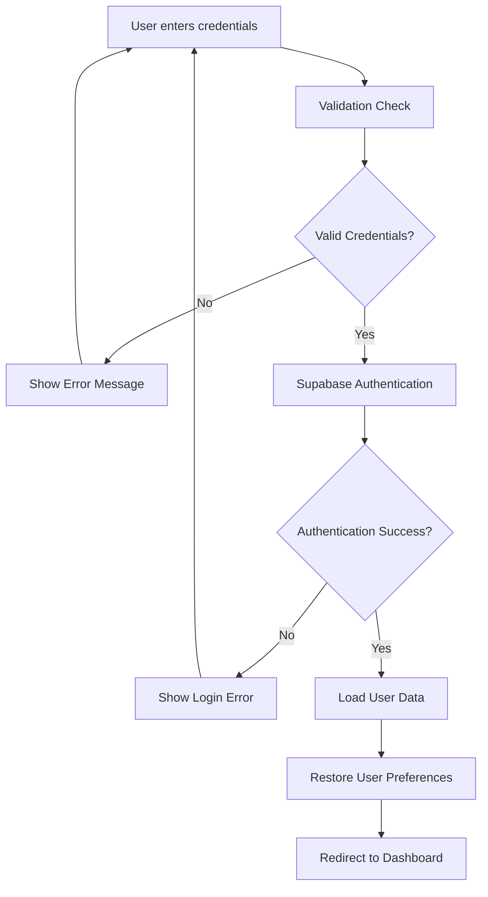

### Password Reset
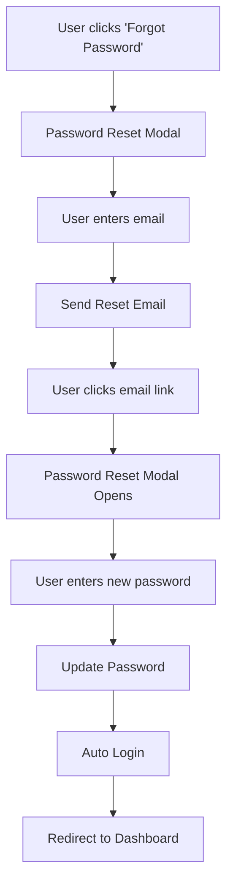

## 💬 Chat Interface Workflow

### Chat Session Flow
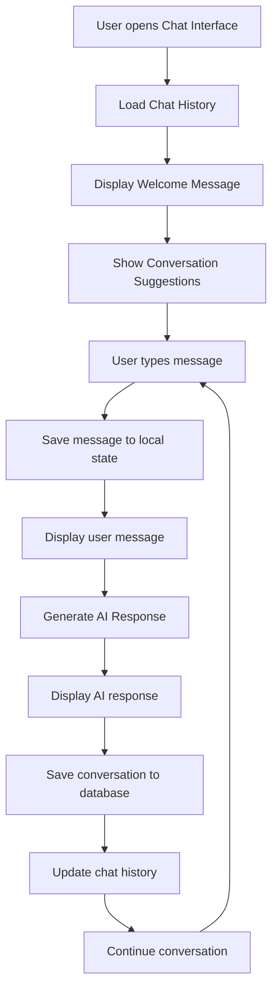

### Data Persistence in Chat
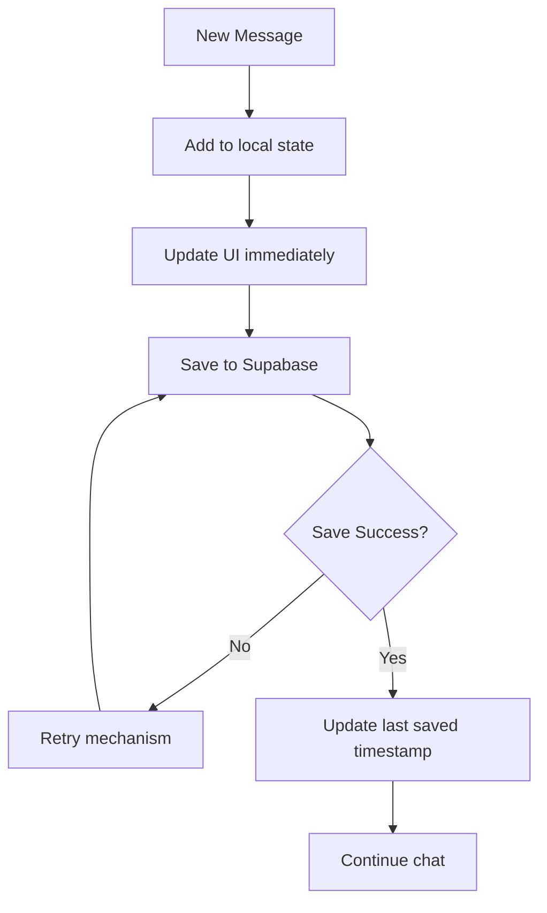

## 👤 User Profile Workflow

### Profile Access
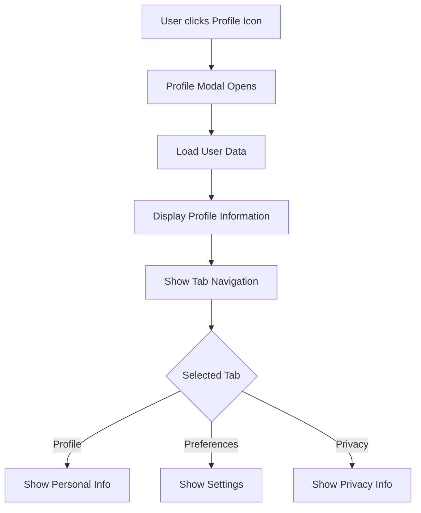

### Preferences Management
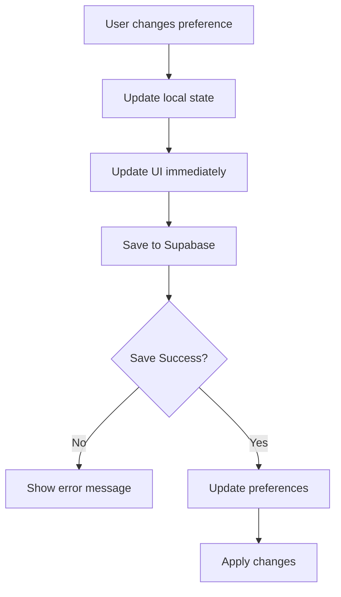

### Dark/Light Mode Toggle
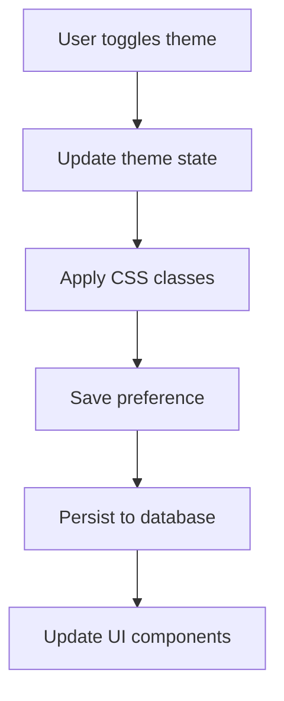

## 💾 Data Persistence Workflow

### Data Loading
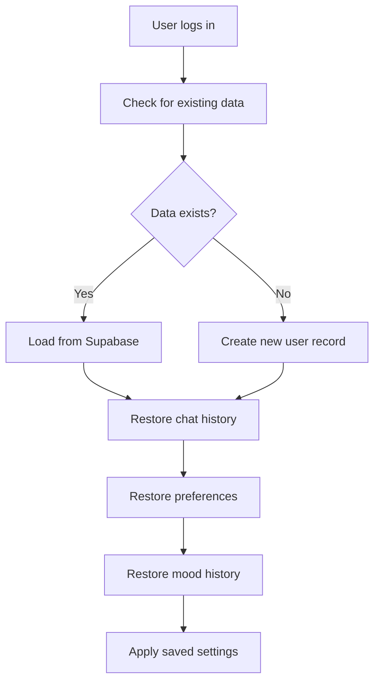

### Data Saving
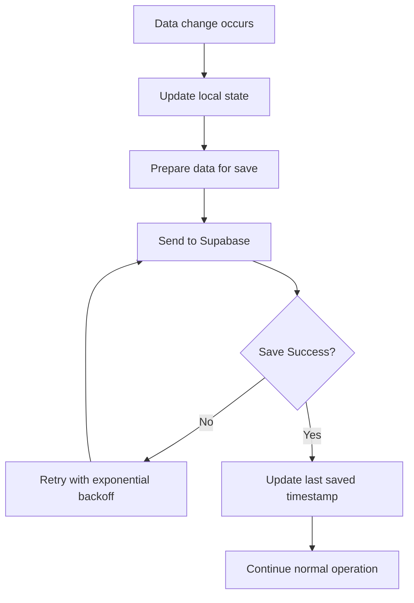

### Real-time Sync
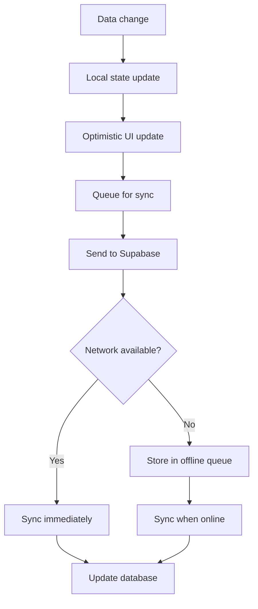

## 🆘 Crisis Support Workflow

### Crisis Resource Access
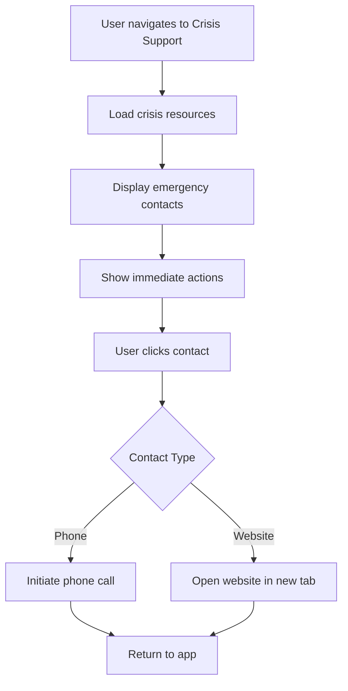

### Emergency Contact Flow
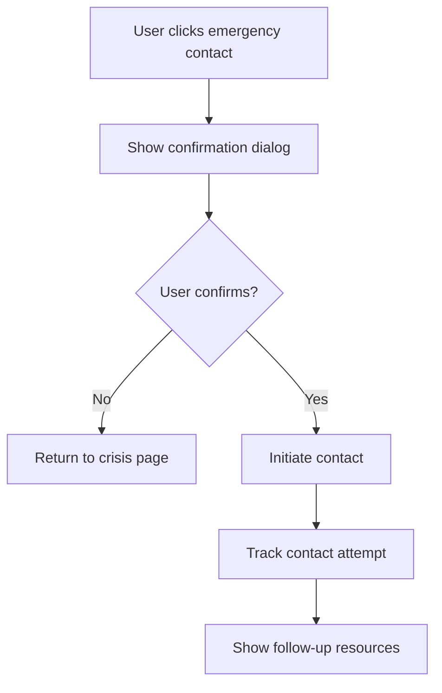

## 🏗️ Technical Architecture

### Component Hierarchy
```
App.js
├── Welcome Page (unauthenticated)
├── Main Dashboard (authenticated)
│   ├── Header
│   │   ├── Logo
│   │   ├── Navigation
│   │   ├── Theme Toggle
│   │   └── User Profile Button
│   ├── Chat Interface
│   │   ├── Chat History Sidebar
│   │   ├── Messages Container
│   │   ├── Input Area
│   │   └── Suggestions
│   ├── Resource Cards
│   ├── Crisis Support
│   └── Footer
├── Login Modal
├── Password Reset Modal
└── User Profile Modal
```

### Context Providers
```
AppContext
├── Dark mode state
├── User preferences
├── Chat history
├── Mood tracking
└── Data persistence

SupabaseAuthContext
├── Authentication state
├── User session
├── Login/logout functions
└── Password reset

LanguageContext
├── Current language
├── Translations
└── Language switching
```

### Data Flow
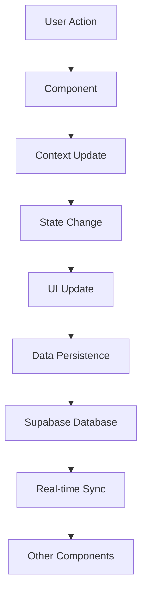

## ⚠️ Error Handling

### Authentication Errors
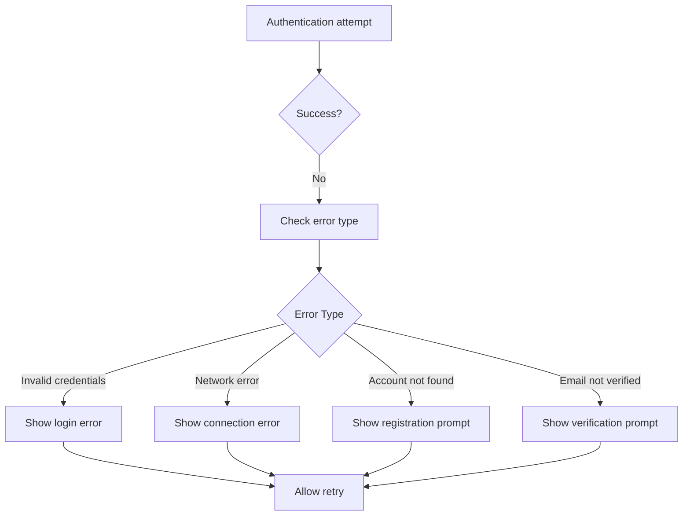

### Data Persistence Errors
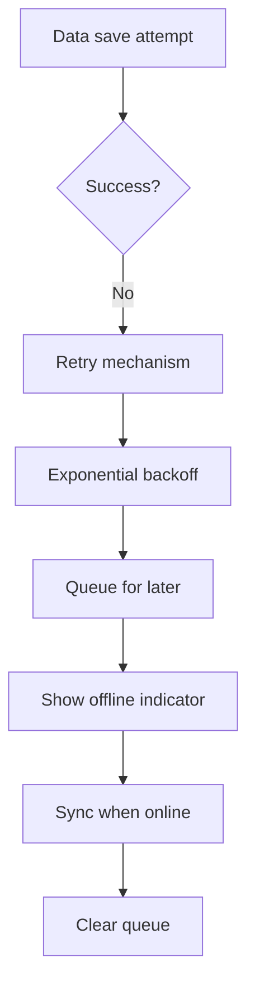

### Network Error Handling
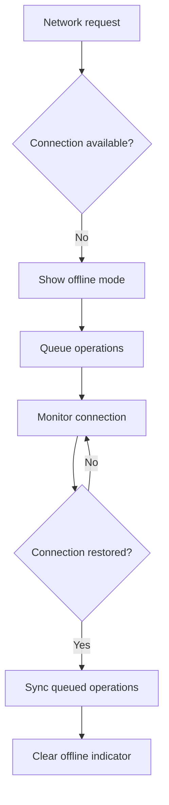

## 🔒 Security Measures

### Authentication Security
- **Email verification** for new accounts
- **Password strength requirements**
- **Session management** with automatic expiry
- **Secure password reset** via email
- **Rate limiting** on authentication attempts

### Data Security
- **Row Level Security (RLS)** in database
- **User data isolation** - each user only sees their data
- **Encrypted data transmission** (HTTPS)
- **Encrypted data storage** at rest
- **No data sharing** with third parties

### Privacy Protection
- **GDPR compliance** built-in
- **User consent** for data collection
- **Data deletion** capabilities
- **Privacy controls** in user settings
- **Anonymous crisis support** access

## 📱 User Experience Flow

### First-Time User
1. **Landing Page** - Welcome message and app introduction
2. **Get Started** - Call-to-action button
3. **Registration** - Email and password setup
4. **Welcome Tour** - Brief app overview
5. **First Chat** - Guided conversation start
6. **Profile Setup** - Initial preferences

### Returning User
1. **Login** - Quick authentication
2. **Dashboard** - Resume previous session
3. **Chat History** - Continue conversations
4. **Preferences** - Access saved settings
5. **Resources** - Browse mental health content

### Crisis User
1. **Crisis Support** - Immediate access
2. **Emergency Contacts** - Quick contact options
3. **Immediate Actions** - Self-help guidance
4. **Professional Help** - Resource links
5. **Follow-up** - Continued support options

## 🔄 System Integration

### Supabase Integration
- **Authentication** - User management
- **Database** - Data persistence
- **Real-time** - Live updates
- **Storage** - File management
- **Edge Functions** - Serverless operations

### Frontend Integration
- **React Context** - State management
- **Framer Motion** - Animations
- **Tailwind CSS** - Styling
- **Lucide Icons** - UI elements
- **Local Storage** - Offline support

## 📊 Performance Optimization

### Loading Strategy
- **Lazy loading** for components
- **Code splitting** for better performance
- **Image optimization** for faster loading
- **Caching** for frequently accessed data
- **Progressive enhancement** for accessibility

### Data Management
- **Pagination** for large datasets
- **Infinite scroll** for chat history
- **Debounced search** for better UX
- **Optimistic updates** for responsive UI
- **Background sync** for offline support

---

## 🎯 Success Metrics

### User Engagement
- **Daily Active Users** (DAU)
- **Session Duration** per user
- **Chat Messages** per session
- **Feature Usage** statistics
- **User Retention** rates

### Technical Performance
- **Page Load Time** < 3 seconds
- **Authentication Speed** < 2 seconds
- **Data Sync Success Rate** > 99%
- **Error Rate** < 1%
- **Uptime** > 99.9%

### Mental Health Impact
- **Crisis Support** usage
- **Resource Access** frequency
- **User Feedback** scores
- **Professional Help** referrals
- **Community Engagement** levels

---

**This workflow ensures a seamless, secure, and supportive experience for users seeking mental health support through SerenitySaathi.** 🌟 